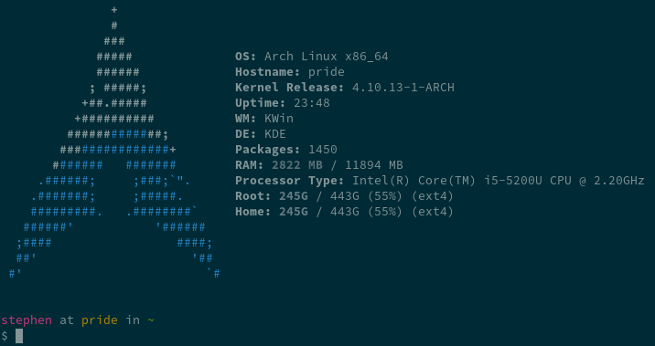

# Dotfiles

This repository contains my dotfiles. I usually keep the repository in
`~/.dotfiles`. The shell script `symlink.sh` should create all the necessary
symlinks. Should work on Mac and Linux equally well.

## Workflows

I've maintained these dotfiles for a fairly long time now, and they support some
very particular workflows and behaviors.

### Operating System

I work mainly in Arch Linux, using KDE Plasma as my desktop environment. I also
use Mac OS (macOS? whatever they're styling it these days) for work, and many of
these dotfiles apply on that machine.

### Editing

My history with editors has been a long one. I started with Emacs and all its
glory. I have grown from a heavily customized, flung-together Emacs
[config][old-emacs] (now unused), to using the Spacemacs distribution with some
mild customizations. Spacemacs provides nice, happy defaults, dependency
management (I hate installing emacs packages) and a good deal of other goodies,
along with nice eye candy. It also pre-configures programming modes to be mostly
functional, which is hugely helpful.

[old-emacs]: https://github.com/brenns10/emacs

My main development editor is stil Emacs, but recently I have made the jump to
the Vim style keybindings (via Evil+Spacemacs support). I have also made the
jump to Vim for small editing (READMEs, emails, small amounts of C code, etc).
It starts up quickly and is pretty universal. However, when working in large
projects where I want IDE-like features (C tags support, jump to definition,
etc), I simply use Emacs. I like this arrangement, and in order to maintain that
boundary, I'm trying to impose a strict no-plugins rule on my vim config.

### Git

My git config has a few shortcuts, and the email/editor settings are most
important.

### Email

The further I get into reading mailing lists, doing kernel dev, and doing the
[Eudyptula Challenge][], the more I need to have a good console email client. I
certainly don't use it for all of my email - Gmail and Inbox are superb clients
for the everyday sort of mail. But lots of email lists expect text-only emails,
and for that you need a suitable mail client.

I have one email account in particular that I use for these communications. I
filter mailing lists into an IMAP folder and I read that in mutt. The main inbox
also gets forwarded into my Google Inbox so that I can read everyday emails
there as well.

[Eudyptula Challenge]: http://eudyptula-challenge.org/

I have Gnus set up for Emacs, but just don't bother with that.

## Setup

### Required Prereqs

Without these this whole exercise would probably be pointless.

- `git` is pretty required
- `bash` too

### Optional Prereqs

You'll probably want at least some of these tools, because they are kinda why I
have my configuration version controlled.

- `emacs` + `spacemacs`, since the editor is set to this

        $ git clone git@github.com:syl20bnr/spacemacs.git .emacs.d

- If you want to use mercurial, make sure you have `hg-git` installed.
- If you use Arch, `archey3` is supported. Install it to get a nice startup
  screen on all your terminals.
- If you use Ruby, `rbenv` is supported. You'll want to do:

        $ git clone https://github.com/rbenv/rbenv.git ~/.rbenv
        $ git clone https://github.com/rbenv/ruby-build.git ~/.rbenv/plugins/ruby-build

- Mutt is a console email client. I have a configuration that is tied to my own
  email account -- you'd need to edit it to connect to your own SMTP, IMAP, and
  account. You will of course need to install Mutt.
  - A private file `passwords` is stored outside of version control inn
    `~/.mutt`, containing `set imap_pass=<password>`.
- Similarly, Gnus is an Emacs-based mail client. I never use it, but I have it
  configured in `.spacemacs`. The passwords are stored in a standard `.authinfo`
  file.

### Install

Simply clone this repo right into `~/.dotfiles`, and then run the symlink
script. Running the symlink script **will clobber** anything that preexisted,
and it **will not ask before doing so**. If you're looking to try out parts of
my dotfiles, be sure to selectively comment out things that you don't want
clobbered.

    $ git clone https://github.com/brenns10/dotfiles.git ~/.dotfiles
    $ cd ~/.dotfiles
    $ ./symlink.sh

### Post Install

Some things will want to be run for the first time in order to be fully
configured, or need a logout/login to take full effect.

- Emacs will need to run in order to download and install a bunch of packages.
- The ssh-agent won't be running until you log out and back in.

## Note on bashrc vs bash_profile

I use the file `profile` for everything that should happen to set up a login
session, and I ensure that it is run whenever I log in via desktop environment,
TTY, or SSH.

I use the file `bashrc` for everything that should happen to set up bash for a
shell session in which I will by typing commands manually.

When I run an interactive login shell (e.g. SSH or TTY login), this is run *in
addition* to the `profile`.

Some examples:
- Log into DE: `profile` is run (`.xprofile` is linked to it)
    - Then run interactive shell: `bashrc` is run. Settings from `profile` are
      inherited.
- Log in via TTY: `bash_profile` is run, which sources `profile` and then
  `bashrc`
- Log in via SSH: `bash_profile` is run, (similar to above)

The only exception is Mac OS X. Although `profile` is run when you log in, the
Terminal app runs Bash as a login shell, meaning that `profile` will run a
second time. To avoid this, use iTerm :)
